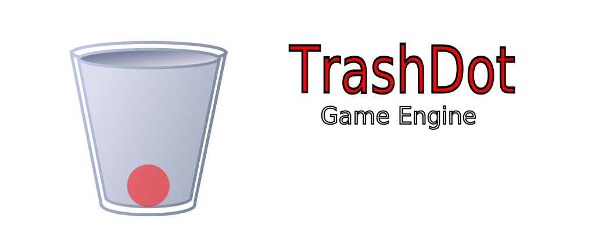

# TrashDot Engine

  

## 2D and 3Dish cross-platform game engine

**TrashDot Engine is a feature-packed, cross-platform
game engine to create 2D and 3Dish games from a unified interface.** It provides a
comprehensive set of common tools, so that users can focus on making games
without having to reinvent the wheel. Games can be exported with one click to a
number of platforms, including the major desktop platforms (Linux, macOS,
Windows), mobile platforms (Android, iOS), as well as Web-based platforms
(HTML5).

## Free and open source
TrashDot is completely free and open source under the very permissive MIT license.
No strings attached, no royalties, nothing. The users' games are theirs, down
to the last line of engine code.

### Compiling from source

[See the official docs](https://docs.godotengine.org/en/latest/development/compiling/)
for compilation instructions for every supported platform.

## Documentation and demos

The official documentation is hosted on [ReadTheDocs](https://docs.godotengine.org).
It is maintained by the Godot community in its own [GitHub repository](https://github.com/godotengine/godot-docs).

